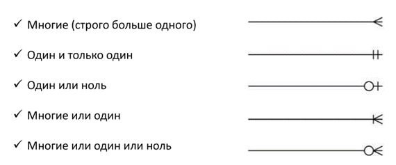
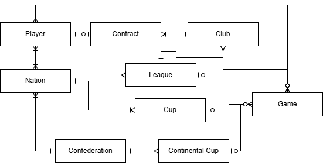
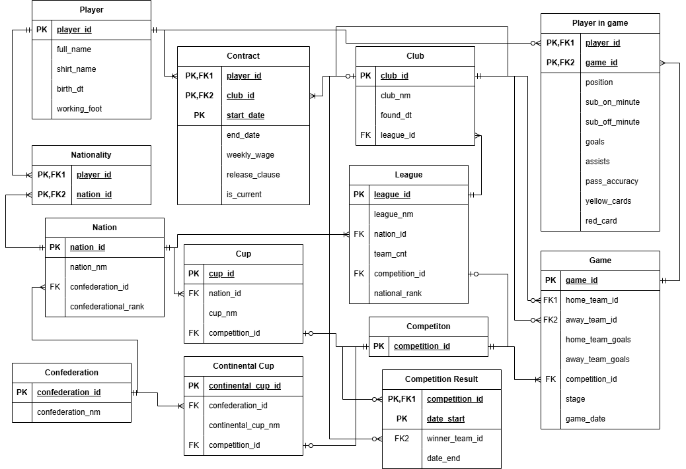
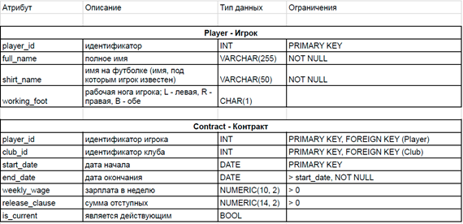

# Занятие №4. Проектирование БД и работа с типами данных

## Приведение типов

### Явное приведение типов

Явное приведение типов осуществляется двумя способами:
- CAST(expression AS type)
- expression::type

Например:
```sql
SELECT CAST('123' AS INT);

SELECT '123.45'::NUMERIC;
```

Допускаются явные преобразования
- любого типа в строку (если указать строку недостаточной длины - то будут записаны только N первых символов) и обратно (при валидном значении в строке)
- между целыми числами (только если значение допустимо для нового типа)
- из целых и дробных чисел в дробные числа другого типа / точности (при преобразовании в NUMERIC обязательна возможность сохранить целую часть, дробная часть может быть обрезана)
- между типами даты и времени (рассмотрим дальше)
- между BOOL и целыми числами (0 - FALSE, остальные - TRUE)

### Неявное приведение 

В некоторых случаях преобразования типов могут произойти неявно:
- при сравнении со столбцом (СУБД знает тип столбца):
```sql
SELECT * FROM shop.orders WHERE order_id = '10'; --order_id имеет тип INT
```
- при арифметических операциях между разными числовыми типами (преобразование произойдет по иерархии SMALLINT → INTEGER → BIGINT → NUMERIC → DOUBLE PRECISION; REAL при операции с любым типом кроме REAL переходит также в DOUBLE PRESICION)

- при однозначном преобразовании в операциях:
```sql
SELECT 1 + '2'; --3
```

## Работа с текстовыми данными

Для работы с данными текстовых типов (CHAR, VARCHAR, TEXT) в PostgreSQL существуют следующие функции:
- Конкатенация
``` sql
SELECT 'Hello' || ' ' || 'World';
```
- Изменение регистра
``` sql
SELECT lower('HELLO');
SELECT upper('hello');
SELECT initcap('hello world'); -- все слова с большой буквы
```
- Длина строки

``` sql
SELECT length('PostgreSQL');
```
- Удаление пробелов

``` sql
SELECT trim('  text  ');
```
- Взятие подстроки

``` sql
SELECT substring('PostgreSQL' FROM 1 FOR 4); -- нет ошибки в случае выхода за границу
```
- Поиск первого вхождения подстроки

``` sql
SELECT position('SQL' IN 'PostgreSQL');
```

- Замена

``` sql
SELECT replace('Hello world', 'world', 'SQL');
```

- Проверка соответствия паттерну

``` sql
SELECT *
FROM customers
WHERE email LIKE '%gmail.com'; 
```
"_" - ровно 1 символ \
"%" - 0 или более символов


- Проверка паттерна без учета регистра

``` sql
SELECT *
FROM customers
WHERE name ILIKE 'alex%';
```

- Проверка соответствия регулярному выражению

```sql
SELECT 'abc123' ~ '^[a-z]+[0-9]+$';
```

- Поиск паттерна как регулярного выражения

```sql
SELECT regexp_match('abc123', '[0-9]+');
```

- Замена паттерна как регулярного выражения

```sql
SELECT regexp_replace('abc123def', '[0-9]+', 'X');
```

## Работа с датой и временем

### Типы данных:

-   DATE
-   TIME (TIMETZ)
-   TIMESTAMP (TIMESTAMPTZ)
-   INTERVAL

### Текущие значения

``` sql
SELECT CURRENT_DATE;
SELECT CURRENT_TIME;
SELECT CURRENT_TIMESTAMP;
```

### Константы

Даты задаются в формате 'YYYY-MM-DD' или 'MM-DD-YYYY'.

Время задается в формате 'HH:MM:SS' или 'HH:MM' (в таком случае будет 0 секунд).

TIMESTAMP задается в формате 'дата:время', где дата и время - в любом из форматов выше.


### INTERVAL

Обозначает промежуток (количество) времени. Создается из строки вида 'Y years M months D days H hours m minutes S seconds'. 


### Операции

- [DATE | TIMESTAMP] + INTERVAL -> TIMESTAMP
- TIME + INTERVAL -> TIME
- TIMESTAMP - [DATE | TIMESTAMP] -> INTERVAL
- DATE - TIMESTAMP -> INTERVAL
- DATE + INTEGER -> DATE (INT интерпретируется как количество дней)
- DATE - DATE -> INT (разница в днях)

### Извлечение части даты

``` sql
SELECT extract(year FROM CURRENT_DATE);
SELECT extract(minutes FROM CURRENT_TIMESTAMP);
```

Можно вытаскивать:
- millenium
- century
- decade (десятилетие)
- year
- doy (номер дня в году)
- quarter (квартал)
- month
- week
- dow (день недели, воскресенье = 0, далее 1-6)
- day
- hour
- minute
- second

### Округление

``` sql
SELECT date_trunc('month', CURRENT_TIMESTAMP); --переход к началу текущего месяца
```

### Преобразование типов

При преобразовании типа TIMESTAMP к DATE или TIME сохраняется только дата или время соответственно. При преобразовании DATE к TIMESTAMP время будет установлено на 00:00:00. Приводить TIME к TIMESTAMP нельзя. 

## Проектирование баз данных

Проектирование базы данных проходит в 3 этапа, на каждом из которых строится соответствующая модель данных:

### Концептуальное

Строится диаграмма сущность-связь (ER), демонстрирующая сущности выбранной предметной области и связи между ними (в нотации "Воронья лапка")



Пример концептуальной модели



### Логическое

Строится уточненная диаграмма, где для сущностей показываются
- атрибуты
- первичные ключи (обязательно 1 в каждой)
- внешние ключи (таким образом связи учтоняются до связей конкретных атрибутов)

Также на это этапе происходит нормализация данных и разбиение связей "многие ко многим".

Пример логической модели



### Физическое

Уточняется реализация всех сущностей в виде таблиц в конкретной СУБД. Для каждой таблицы указываются типы данных всех атрибутов, ограничения. После завершения физического проектирования БД может быть создана при помощи СУБД.

Фрагмент примера физической модели



## Практические задания

Во всех заданиях используется таблица `sem4.people` со следующими полями:

* `person_id` - идентификатор человека
* `first_name` - имя
* `last_name` - фамилия
* `email` - адрес email
* `bio` - краткое описание
* `birth_date` - дата рождения
* `created_at` - дата регистрации
* `last_login` - дата последнего входа

Скрипт для вставки данных лежит в папке семинара.

## Задание 1

Выведите:

- `first_name`
- `last_name`
- `first_name` в верхнем регистре (`first_name_upper`)
- `last_name` в нижнем регистре (`last_name_lower`)

---

## Задание 2

Сформируйте поле `short_name` в формате:

```
Ivanov I.
```

Выведите:

- `person_id`
- `short_name`

---

## Задание 3

Найдите людей, у которых длина `email` больше 18 символов.

Выведите:

- `person_id`
- `email`
- длину email (`email_length`)

---

## Задание 4

Выведите людей, у которых email заканчивается на `.com`.

Поля результата:

- `person_id`
- `email`

---

## Задание 5

Для каждого человека найдите позицию символа `@` в email.

Выведите:

- `person_id`
- `email`
- `at_pos`

---

## Задание 6

Разделите email на две части:

- логин (часть до `@`) — `email_login`
- домен (часть после `@`) — `email_domain`

Выведите:

- `person_id`
- `email`
- `email_login`
- `email_domain`

---

## Задание 7

Выведите для каждого человека измененное описание `bio`, где замените слово `Premium` на `Standard`

---

## Задание 8

Выведите:

- текущий год
- текущий час и минуту

---

## Задание 9

Из поля `created_at` получите:

- `person_id`
- `created_at`
- год (`created_year`)
- месяц (`created_month`)
- день недели (`created_dow`)

---

## Задание 10

Для каждого человека сформируйте строку вида:

```
Ivanov I. is 2 years 3 month with us
```
